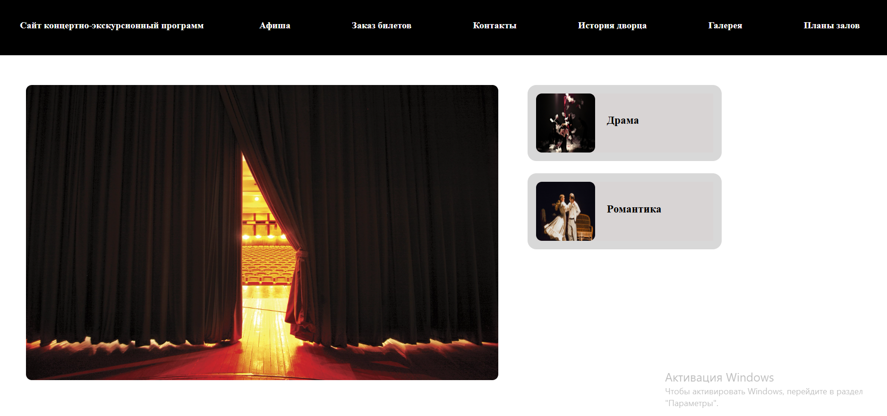
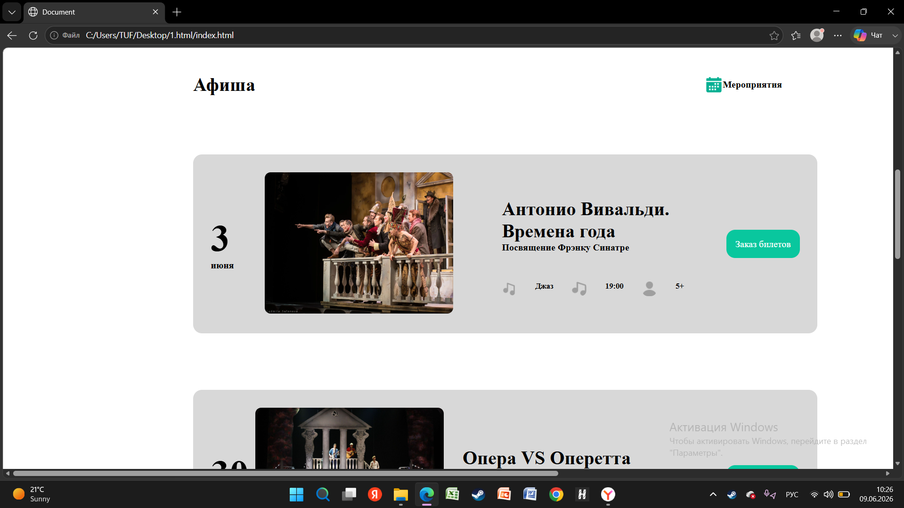
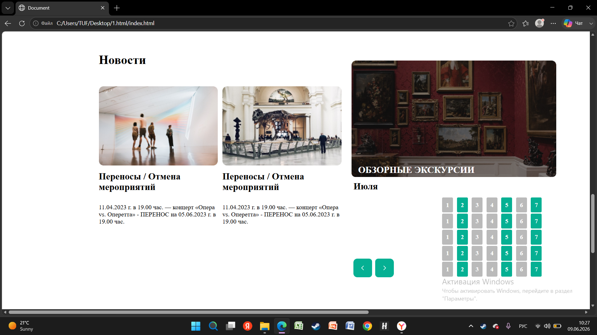

# Theatre Event Website

## Description

This is a static theatre event website built with HTML and CSS.  
The project demonstrates page layout, navigation, event cards, news blocks, gallery elements, footer design, typography, spacing, and working with images.

The website is designed as a concert and excursion event page with sections for events, tickets, contacts, history, gallery, and hall plans.

## Screenshots

### Main Page

### Events Section

### News Section

## Features

- Navigation menu
- Main hero section
- Event schedule section
- Event cards
- News section
- Gallery-style image blocks
- Calendar-style layout
- Footer with contact information
- Image-based content sections
- Custom typography and spacing

## Technologies

- HTML5
- CSS3

## Project Structure

- `index.html` — main page structure
- `style.css` — main stylesheet
- `screenshots/` — project screenshots
- `photo0.jpg`, `photo1.jpg`, etc. — images used in the website
- `Vector (1).png`, `Vector (2).png`, etc. — icons used in the layout

## How to View

Open `index.html` in a browser.

## Future Improvements

- Add responsive design for mobile devices
- Add JavaScript interactivity
- Add working navigation links
- Add real event filtering
- Improve accessibility
- Organize images into a separate `images/` folder
